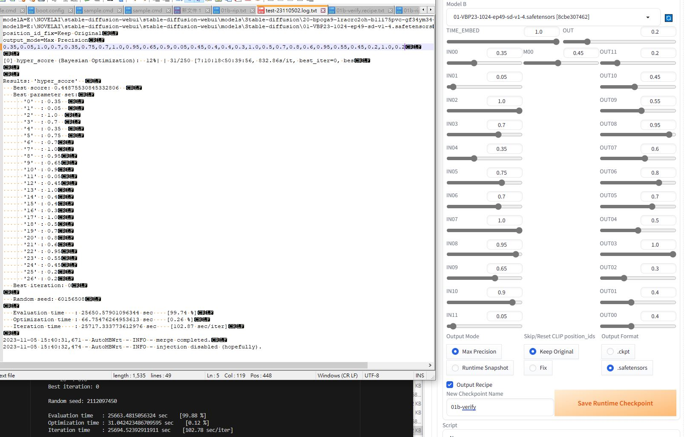

# WebUI 1.6.0 fix on 231030 with install guide by 6DammK9

- *Only tested in Winodws a.k.a my machine.* I'm not [gradio](https://www.gradio.app/) / [webUI](https://github.com/AUTOMATIC1111/stable-diffusion-webui) expert therefore do not expect any auto / e2e solutions.

- **NO SUPPORT FOR aki / "秋葉" build.**

- Also I do not gruntee to have any decent test coverage. Check out [this extension](https://github.com/s1dlx/sd-webui-bayesian-merger) which is doing what I'm aiming for (but it doesn't include ImageReward, and code is older).

## Install prerequisites

1. Install these extensions via "Extensions" > "Install from URL":

- [~~sd-webui-runtime-block-merge~~](https://github.com/Xynonners/sd-webui-runtime-block-merge),  [my fork instead](https://github.com/6DammK9/sd-webui-runtime-block-merge)

- [sd-webui-lora-block-weight](https://github.com/hako-mikan/sd-webui-lora-block-weight)

2. Install `dynamicprompts` via [wheels from pypi](https://pypi.org/project/dynamicprompts/#files):

- Download the *.whl file (`dynamicprompts-0.29.0-py2.py3-none-any.whl`)

- Run in cmd: `"FULL_PATH_OF_YOUR_A1111_WEBUI\venv\Scripts\python.exe" -m pip install path_of_the_whl_file.whl --prefer-binary`

3. You may face "Premission denied" while moving extension from `tmp` to `extensions`: 

- Either `cd extensions` and then `git clone https_github_com_this_repo` and then restart WebUI 

- Or make a directory `auto-MBW-rt` directly in `tmp` then rerun the installation.

4. From [AutoMBW V1](https://github.com/Xerxemi/sdweb-auto-MBW), make sure your WebUI instance has API enabled as `--api` in `COMMANDLINE_ARGS`.

```bat
REM 2nd SD (7861) for 2nd GPU (1)
set COMMANDLINE_ARGS=--medvram --disable-safe-unpickle --deepdanbooru --xformers --no-half-vae --api --port=7861 --device-id=1
```

5. Install these extensions via "Extensions" > "Install from URL":

- [Obviously this branch.](https://github.com/6DammK9/auto-MBW-rt)

## Basic procedure

1. "Make payload". Treat it like "trigger words", or anything you like, or [testing dataset in AI/ML.](https://en.wikipedia.org/wiki/Training,_validation,_and_test_data_sets)

- A minimal payload (e.g. single 512x512 image) is suggested if you are using it for the first time, to make sure the code works. ~~programmer's life~~

- Payloads are stored in `payloads/*.json`.

2. "Set classifier". I like [BayesianOptimizer](https://nbviewer.org/github/SimonBlanke/hyperactive-tutorial/blob/main/notebooks/hyperactive_tutorial.ipynb) with [ImageReward](https://github.com/THUDM/ImageReward). 

- **I will set my recommended values as default.**

3. "Search". For RTX 3090, it *requires around 60x time for each payload.* If the payload takes around 15 seconds to complete, it takes around 15 minutes. It applies for a batch using 4 minutes (4.5 hours).

- Optimization part (on test score) takes only a few seconds to compelete. 26 parameters is easy, comparing to [860M for SD](https://huggingface.co/docs/diffusers/v0.5.1/en/api/pipelines/stable_diffusion). 

- You may see ["Warning: training sequential model failed. Performing random iteration instead."](https://github.com/SimonBlanke/Gradient-Free-Optimizers/blob/master/gradient_free_optimizers/optimizers/smb_opt/smbo.py#L153) It means that the optimizer has nothing to initialize but pure random. Ignore this if you're going to start from random weights. 

4. See `csv/history/*/*.csv` for results. Also see `models/Stable-diffusion/*.test-23110502.recipe.txt` for a formatted receipe.

## If you encounter errors

- Trust me. **Always reboot webUI first.** State control in WebUI (even python) is awful.

### Encountered errors that I cannot solve (limitation)

- Currently I am experiencing Error when updating the "UNET Visualizer" and "Gallery". It is deep into Gradio's Queue and I am unable to fix it. However before it throws error, I can see live update. Since it is not fatal crash, I'll leave it open and ignore this issue.

```txt
ERROR:    Exception in ASGI application
Traceback (most recent call last):
...
h11._util.LocalProtocolError: Can't send data when our state is ERROR
```

- If the worst case happens a.k.a. program crash while merging after optimization, you will need to merge manually with the receipe (27 numbers, indexed from 0 to 26). **Since there is bug in [sd-webui-runtime-block-merge](https://github.com/Xynonners/sd-webui-runtime-block-merge), please refer the image below.** [PoC script.](docs/recover_from_log.py) tldr: IN00-IN11, M00, TIME_EMBED, OUT00-OUT11, OUT. *Fixed in my fork. Swap it back if using my fork.*



- (Related to the previous error), if you see the `hyper_score` is reporting the **same score with wrong iterlation count** (e.g. always 0.529 with iter 1, 2, 4, 8 etc.), the merge already failed, and you should restart the WebUI. I have found that it is usually caused by Model A / B are same as the WebUI's selected model. I have added checking about this issue.

## Observations and explanations of parameters

- For "Search Type A" and "Search Type B", they are related "Opt (A to B)" for switching streadgy in runtime. *By default it is solely using Type A*.

- For "P1 / P2 / P3", they also switch streadgy in runtime, in simple iteration in sequence. *By default only P1 is enabled*. ~~Some ML algorithms requires consistency, I'll add reference if I really find the reasoning on this feature.~~

- **"Force CPU" is forced on.** I see `RuntimeError: expected device cuda:0 but got device cpu` if it is off ~~and it is a headache to trace and move all tensors.~~

- **"Test Intervals" upper range is raised to 10000.** Using 20+ for `BayseianOptimizer` will raise `ValueError: broadcast dimensions too large.` already ([np.meshgrid](https://github.com/SimonBlanke/Gradient-Free-Optimizers/blob/master/gradient_free_optimizers/optimizers/smb_opt/smbo.py#L103)). I was considering 10000 i.e. 4 DP. Unless you are doing exhausive Grid search, any search in relative scale desires for a fine space. Merge ratio is also in relative scale a.k.a fraction, which you don't need 1 DP if you are not required to remember the numbers (opposite of human search in MBW):

```py
all_pos_comb = np.array(np.meshgrid(*pos_space)).T.reshape(-1, n_dim)
```

```py
    if args[params["chk_enable_clamping"]]:
        search_space.update({str(idx): [*np.round(np.linspace(args[clamp_lower[idx]], args[clamp_upper[idx]], num=args[pass_params["sl_test_interval"]]+1), 8)]})
    else:
        search_space.update({str(idx): [*np.round(np.linspace(lower, upper, num=args[pass_params["sl_test_interval"]]+1), 8)]})
```

- After serval actual runs, *unfourtunately 20 intervals still occasionally throws the same error while performing `meshgrid`*, meanwhile it takes 2-3 time longer to complete an iterlation, and it is also 2-3 times harder to converge. **"Test Intervals" default will be stayed at 10.** These are the optimizers using `meshgrid`:

```txt
LipschitzOptimizer
BayesianOptimizer
ForestOptimizer
```

- **Keep "Test Grouping" as 1.** I don't know why we need to repeat the parameters. [Is it related to supersampling?](https://en.wikipedia.org/wiki/Supersampling)

```py
    grouping = localargs.pass_through["grouping"]
    tunables = localargs.pass_through["tunables"]
    testweights = localargs.pass_through["weights"].copy()
    for key in tunables:
        for interval in range(grouping):
            testweights[int(key)*grouping+interval] = localargs[key]

```

- **Initialize Grid / Vertex / Random should be ignored.** It is only useful if you are dedicated to search from the extreme ratios first (pure A by experience). Also the search parameters are way too much (24 + 2 in total). *It will waste so much time.*

- **"Warm Start" will be disabled.** It means "Read the parameters from the input for initialization", with the 26 slidebars provided. Disable for random initialization (common for DNN training).

- Clamping / LoRA is untouched. I only moved the UI components to reduce some area. 

- "Early Stop" is enabled with parameters is slighty raise to 27, which is parameter counts. It is a common setting for [Early stopping](https://en.wikipedia.org/wiki/Early_stopping). The iterlation count is also raised to 270 (expect 10 intervals).

- **Search Time is greatly increased to 10000 minutes (around 7 days).** It was 2880 minutes (2 days). I have found that my prefered payloads (12 payloads x 1 image) takes longer then 2 days for worst case (expected 12 hours). It is comparable to common SD / LoRA finetuning, but computational power is still minimum (only t2i).

## Change Log 

- Logger is added. Inspired from [sd-webui-animatediff](https://github.com/continue-revolution/sd-webui-animatediff) and [sd-webui-controlnet
](https://github.com/Mikubill/sd-webui-controlnet).

- Fix for multiple SD instandces. It reads `--port` instead of hardcoded `http://127.0.0.1:7860`.

- **Rearrange the UI components.** It is so raw and confusing.

## This is part of my research.

- Just a hobby. [If you are feared by tuning for numbers, try "averaging" by simply 0.5, 0.33, 0.25... for 20 models. It works.](https://github.com/6DammK9/nai-anime-pure-negative-prompt/tree/main/ch05).

----

# auto-MBW-rt | a.k.a V2-BETA
*NOTE: THIS IS IN BETA. NEWER COMMITS MAY BREAK OLDER ONES. FUNCTIONALITY NOT GUARANTEED.*

An automated (yes, that's right, **AUTOMATIC**) MBW extension for AUTO1111.

Rewritten from scratch (not a deviation) UI and code.

Old (V1) example models here: https://huggingface.co/Xynon/SD-Silicon

Old (V1) article here: https://medium.com/@media_97267/the-automated-stable-diffusion-checkpoint-merger-autombw-44f8dfd38871

----

Made by both Xynon#7407 and Xerxemi#6423.

----

Big thanks to bbc-mc for the original codebase and the start of this merge paradigm. 

You can find it here: https://github.com/bbc-mc/sdweb-merge-block-weighted-gui

**MERGING BACKEND**: Huge thanks to ashen

https://github.com/ashen-sensored/sd-webui-runtime-block-merge

**LORA BACKEND**: Huge thanks to hako-mikan

https://github.com/hako-mikan/sd-webui-lora-block-weight

**LORA BACKEND (SOLID)**: Huge thanks to hako-mikan

https://github.com/hako-mikan/sd-webui-supermerger

**OPTIMIZER LIB**: Massive thanks to SimonBlanke

https://github.com/SimonBlanke/Hyperactive

----

Wiki/Documentation

*coming soon<sup>TM</sup>*
